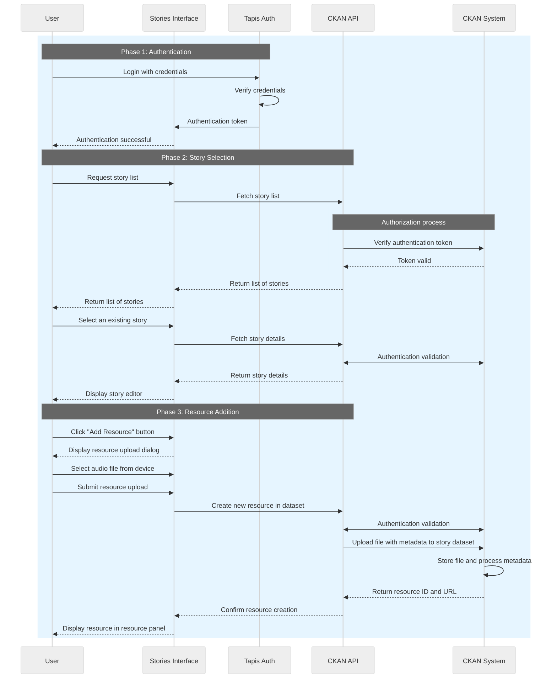

# Stories Interface Architecture Design

This document describes the user workflow and system architecture for the Stories Interface application, a React-based platform for capturing and displaying stories with integrated resource management capabilities.

## System Overview

The Stories Interface enables users to create and manage stories by uploading and organizing various media resources including audio files, documents, and images. The system integrates with Tapis authentication and CKAN for dataset management.

## User Workflow Diagram

## Workflow Description

This sequence diagram illustrates the complete user journey through the Stories Interface application across three distinct phases:

### Phase 1: Authentication
- **User Authentication**: Users authenticate through the Tapis authentication system using their credentials
- **Token Management**: Upon successful verification, Tapis provides an authentication token to the Stories Interface
- **Session Establishment**: The interface confirms authentication success, enabling access to protected features

### Phase 2: Story Selection and Management  
- **Story Discovery**: Users can browse and request lists of available stories from the system
- **Authorization Validation**: The CKAN API validates authentication tokens with the CKAN System for each request
- **Story Access**: Users select existing stories and access the story editor interface with full story details

### Phase 3: Resource Addition and Integration
- **Resource Upload Interface**: Users access the resource addition dialog to upload various file types
- **File Processing**: The system handles file uploads including audio interviews, documents, and media files
- **Metadata Management**: CKAN processes uploaded files, generates metadata, and stores resources with unique identifiers
- **Resource Integration**: Successfully uploaded resources appear in the resource panel for embedding within stories

## Key System Components

- **Stories Interface**: React-based frontend application with TypeScript
- **Tapis Auth**: Authentication service managing user credentials and JWT tokens
- **CKAN API**: RESTful API handling dataset and resource management operations
- **CKAN System**: Backend data management system storing files, metadata, and story datasets

## Security and Authentication

The system implements comprehensive authentication validation at each API interaction, ensuring secure access to stories and resources. JWT tokens are validated consistently across all CKAN operations, maintaining data integrity and user access controls.
